# Arduino Treasure Seeker Project

## Components
I used 3 components to make this project:
* Arduino Uno with Atmega328P Microcontroller
* AVT1615 Shield 
* LCD    
#### Arduino Uno with Atmega328P Microcontroller
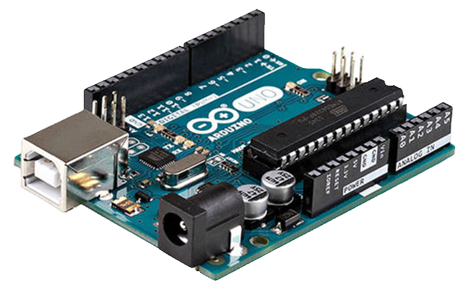   

#### AVT1615 Shield 
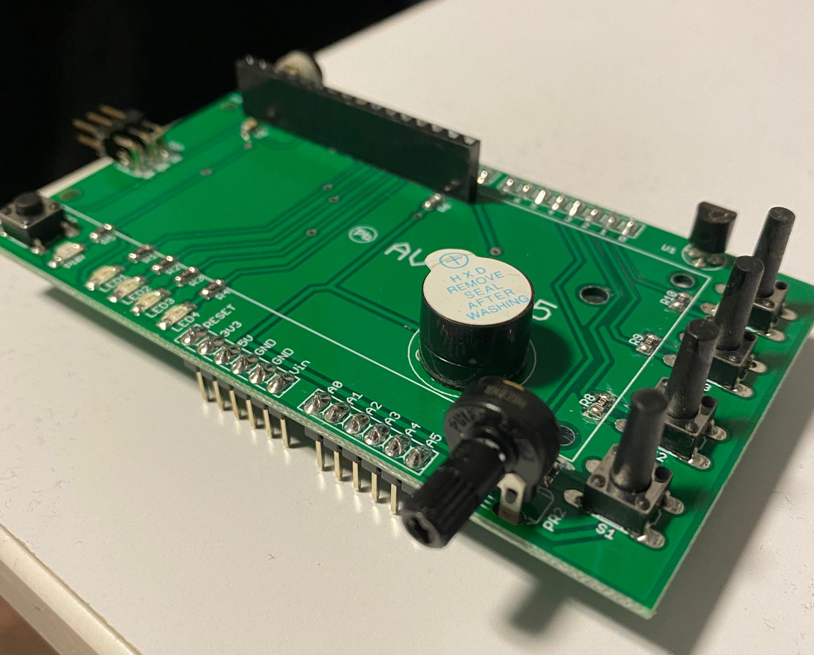  
You can find more information about the AVT1615 shield from the link below  
[AVT1615](https://serwis.avt.pl/manuals/AVT1615.pdf)   

#### Hitachi HD44780 LCD controller
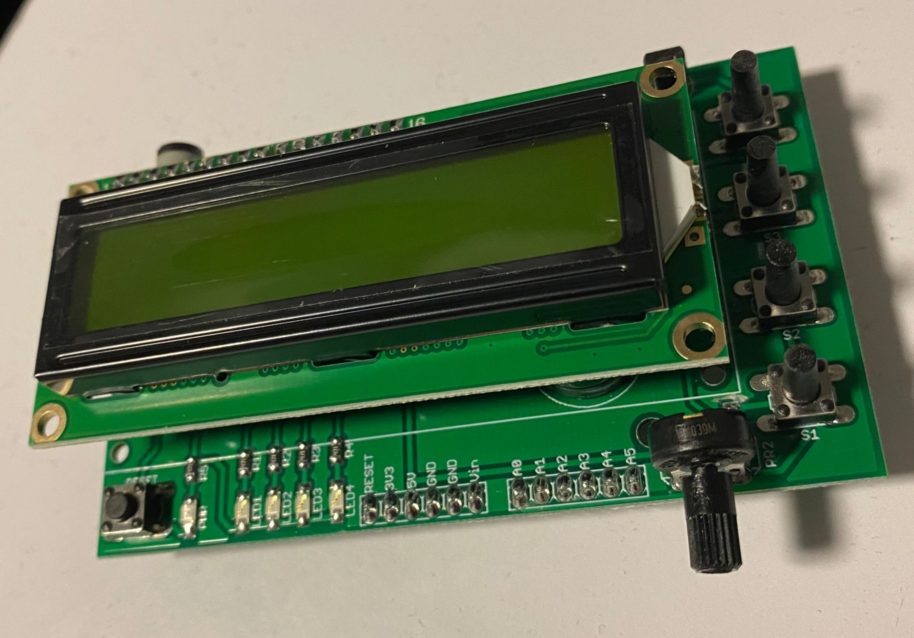   

## Project
It is a game project that you can play with 4 buttons on AVT1615 Shield. LCD show us a part of map whose size can be changed (default 31x31).  
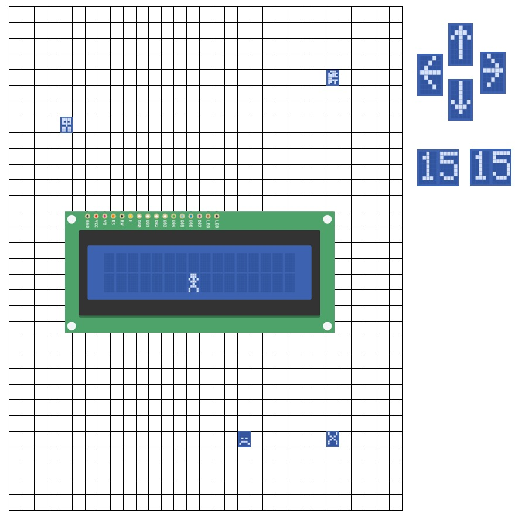   

#### Characters
There are 4 main characters. One of them is ours named human. We play with this character and chase from other ones. We can say that other ones are creatures or monsters. When we move up, down, right and left, you can see them suddenly in the LCD. If we touch them, we lose the game.  

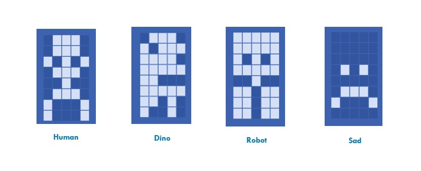   

#### Target
There is one target place, and we call it treasure. It is showed as “X” symbol because it looks like a mark in earth and there is prize under it. When we reach the treasure, we win the game.  

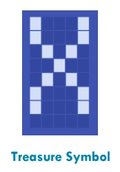   

#### Navigation Symbols
Navigation symbols help us about where we are and which way we are going. We can separate 2 parts. The first one is direction arrows. They show us which way we are going when we push the buttons.  

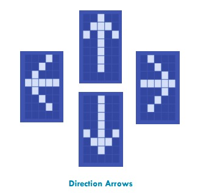  

The second one is our location numbers in the map. They show us where we are currently in the map. Because of using two-dimensional map there are 2 location numbers. From top to bottom and left to right. When we are going to right or left, we will see horizontal location number in the LCD. Despite that, when we are going to up or down, we will see vertical location number. The two location numbers have the same threshold boundary, so our map is square. Once we reach the threshold limits, we cannot go any farther.  

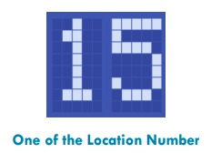  

When we are moving, we see direction arrows and location number like this:  

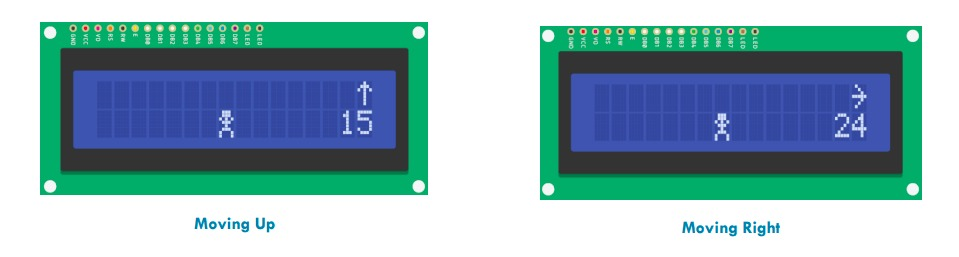   

#### Buttons
There 4 buttons to play game. Every button symbolizes every direction way. You can move every way pushing buttons unless you reach the thresholds.  

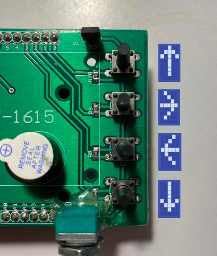   

#### LEDs
There are 4 LEDs on our shield. They show us whether we are close to treasure and creatures or not. Every LED symbolize every characters. From LED1 to LED4, they show us treasure, dino, robot, and sad characters in order. If you are close to a character more than 10 units, the LED of this character start to blink and you are far away from it more than 10 units, it doesn’t blink. You can be close all the characters at the same time, so all the LEDs start to blink.  

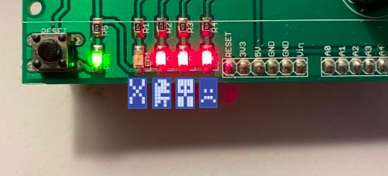   
